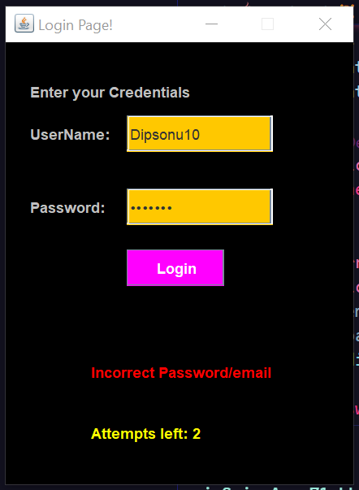

# To create a login page
1. get the the login details 
2. check whether it is correct
3. decrement the attempts 

---
 

---
# steps for creating the GUI using JAVAX Swing
* The user will login with credential 
* able to view his/her calendar with holidays saved by him previously
